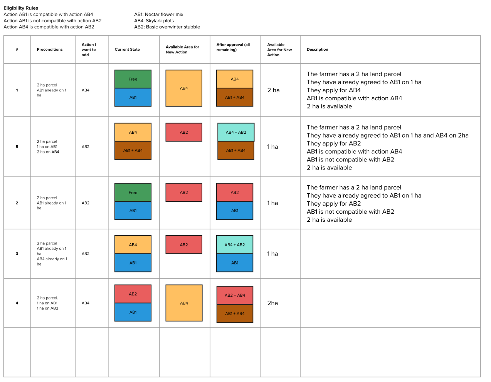

# Land Grants API

To read more about the farming grants platform, see this docs repo:

https://github.com/DEFRA/farming-grants-docs

The capabilities of the land grants API include:

- [land based grant application eligibility checks](#eligibility-checks)
- [grant payment calculations](#payment-calculations)
- [available area calculation](#available-area-calculation)

### Eligibility checks

When an applicant applies for an action to undertake on a land parcel (field), we need to determine their eligibility based on the data we have available. An example of eligibility criteria for the **SCR1: Create scrub and open habitat mosaics** action can be found in [this document](https://www.gov.uk/find-funding-for-land-or-farms/scr1-create-scrub-and-open-habitat-mosaics). This document contains this statement:

| Protected land                               | Eligibility                                                                            |
| -------------------------------------------- | -------------------------------------------------------------------------------------- |
| Sites of special scientific interest (SSSIs) | Ineligible - you must not enter any area that's designated as an SSSI into this action |

In this case, the API will need to check if there is an intersection between the land parcel and the SSSI map layer and reject the application if so.

### Available Area Calculation

The purpose of the Available Area Calculation (AAC) is to work out the number of hectares of a land parcel someone is able to apply a particular action on. Say an applicant has a 3 hectare land parcel, has already agreed to do action **A** on 1 hectare of the parcel, is applying for action **B** and **A** and **B** aren't compatible with each other, the AAC should return 2 hectares.

Some more AAC scenarios are detailed here:



### Payment calculations

Each action has a different way of calculating the total owed annually if the application gets approved and accepted. Most are a simple multiplication of the quantity of measurement applied for by the value. For example, for **SCR1**, the calculation is `£588 per hectare (ha) per year`.

## Repo usage

- [Requirements](#requirements)
  - [Node.js](#nodejs)
- [Local development](#local-development)
  - [Configuration](#configuration)
  - [Setup](#setup)
  - [Development](#development)
  - [Testing](#testing)
  - [Production](#production)
  - [Npm scripts](#npm-scripts)
  - [Update dependencies](#update-dependencies)
  - [Formatting](#formatting)
    - [Windows prettier issue](#windows-prettier-issue)
- [API endpoints](#api-endpoints)
- [Docker](#docker)
  - [Development image](#development-image)
  - [Production image](#production-image)
  - [Docker Compose](#docker-compose)
  - [Dependabot](#dependabot)
  - [SonarCloud](#sonarcloud)
- [Development helpers](#development-helpers)
  - [MongoDB Locks](#mongodb-locks)
- [Licence](#licence)
  - [About the licence](#about-the-licence)

## Requirements

### Node.js

Please install [Node.js](http://nodejs.org/) `>= v18` and [npm](https://nodejs.org/) `>= v9`. You will find it
easier to use the Node Version Manager [nvm](https://github.com/creationix/nvm)

To use the correct version of Node.js for this application, via nvm:

```bash
cd land-grants-api
nvm use
```

## Local development

### Configuration

This API requires a `.env` file to operate, please view the `.env.example` for details of the required properties, talk to a collegue for missing values.

### Setup

Install application dependencies:

```bash
npm install
```

### Development

To run the application in `development` mode run:

```bash
npm run dev
```

### Loading land-data into local postgres:

1. Copy files from https://defra.sharepoint.com/teams/Team1645/Restricted_FCP%20RPS%20Future/Forms/AllItems.aspx?id=%2Fteams%2FTeam1645%2FRestricted%5FFCP%20RPS%20Future%2Fland%2Dgrant%2Dapi%2Ddata&viewid=f5678bbd%2Dae3a%2D4cd4%2D9f4c%2Dab8e79452a94&ovuser=770a2450%2D0227%2D4c62%2D90c7%2D4e38537f1102%2CJilly%2EGledhill%40defra%2Egov%2Euk&OR=Teams%2DHL&CT=1733739622621&clickparams=eyJBcHBOYW1lIjoiVGVhbXMtRGVza3RvcCIsIkFwcFZlcnNpb24iOiI0OS8yNDEwMjAwMTMxOCIsIkhhc0ZlZGVyYXRlZFVzZXIiOmZhbHNlfQ%3D%3D

to srr/api/common/migration folder

2. set environment variables:

- DISABLE_POSTGRES=false
- NODE_ENV=local

Refer: .env.example
If you have issue with .env file set env variables in package.json scripts

```
 "dev": "NODE_ENV=local SEED_DB=true DISABLE_POSTGRES=false npm run server:watch",
```

3. run

```bash
npm run dev
```

4. Successful data load message in the console on start-up

- Successfully loaded postgres data 001-create-schema.sql into Postgis
- Successfully loaded postgres data 002-create-land-table.sql into Postgis
- Successfully loaded postgres data 003-create-land-covers-table.sql into Postgis
- Successfully loaded postgres data 004-create-moorland-designations-table.sql into Postgis
- Successfully loaded postgres data land-parcels-data.sql into Postgis
- Successfully loaded postgres data land-covers-data.sql into Postgis
- Successfully loaded postgres data moorland-designations-data.sql into Postgis

### Testing

To test the application run:

```bash
npm run test
```

### Production

To mimic the application running in `production` mode locally run:

```bash
npm start
```

### Npm scripts

All available Npm scripts can be seen in [package.json](./package.json).
To view them in your command line run:

```bash
npm run
```

### Update dependencies

To update dependencies use [npm-check-updates](https://github.com/raineorshine/npm-check-updates):

> The following script is a good start. Check out all the options on
> the [npm-check-updates](https://github.com/raineorshine/npm-check-updates)

```bash
ncu --interactive --format group
```

### Formatting

#### Windows prettier issue

If you are having issues with formatting of line breaks on Windows update your global git config by running:

```bash
git config --global core.autocrlf false
```

## API endpoints

This API includes swagger documentation, this can be viewed at:

`http://{host_name}:3001/documentation`

## Docker

### Development image

Build:

```bash
docker build --target development --no-cache --tag land-grants-api:development .
```

Run:

```bash
docker run -e PORT=3001 -p 3001:3001 land-grants-api:development
```

### Production image

Build:

```bash
docker build --no-cache --tag land-grants-api .
```

Run:

```bash
docker run -e PORT=3001 -p 3001:3001 land-grants-api
```

### Docker Compose

A local environment with:

- Localstack for AWS services (S3, SQS)
- Redis
- MongoDB
- This service.
- A commented out frontend example.

```bash
docker compose up --build -d
```

### Dependabot

We have added an example dependabot configuration file to the repository. You can enable it by renaming
the [.github/example.dependabot.yml](.github/example.dependabot.yml) to `.github/dependabot.yml`

### SonarCloud

Instructions for setting up SonarCloud can be found in [sonar-project.properties](./sonar-project.properties)

## Development helpers

### MongoDB Locks

If you require a write lock for Mongo you can acquire it via `server.locker` or `request.locker`:

```javascript
async function doStuff(server) {
  const lock = await server.locker.lock('unique-resource-name')

  if (!lock) {
    // Lock unavailable
    return
  }

  try {
    // do stuff
  } finally {
    await lock.free()
  }
}
```

Keep it small and atomic.

You may use **using** for the lock resource management.
Note test coverage reports do not like that syntax.

```javascript
async function doStuff(server) {
  await using lock = await server.locker.lock('unique-resource-name')

  if (!lock) {
    // Lock unavailable
    return
  }

  // do stuff

  // lock automatically released
}
```

Helper methods are also available in `/src/helpers/mongo-lock.js`.

## Licence

THIS INFORMATION IS LICENSED UNDER THE CONDITIONS OF THE OPEN GOVERNMENT LICENCE found at:

<http://www.nationalarchives.gov.uk/doc/open-government-licence/version/3>

The following attribution statement MUST be cited in your products and applications when using this information.

> Contains public sector information licensed under the Open Government license v3

### About the licence

The Open Government Licence (OGL) was developed by the Controller of Her Majesty's Stationery Office (HMSO) to enable
information providers in the public sector to license the use and re-use of their information under a common open
licence.

It is designed to encourage use and re-use of information freely and flexibly, with only a few conditions.
