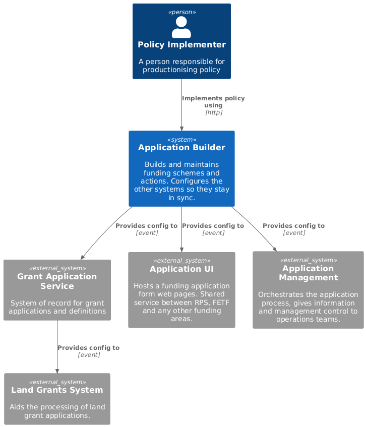

# Application builder system

Builds and maintains funding schemes and actions. Configures the other systems so they stay in sync. This system could be very simple and be implemented with a GitHub repo and a GitHub action, the former storing the config and the latter transmitting it to the other systems. 

## Context diagram

## Capabilities

### Edit application form content

Add/edit/remove application form questions, associate questions with actions.

### Edit eligibility criteria

Make changes to criteria config. Associate eligibility criteria with actions.

### Edit application process flow

Add/edit/remove steps required to resolve issues in applications, e.g. when eligibility criteria fail.

### Provide action version control

Assign version numbers to action iterations, store previous versions and allow rollback.

### Push all config out to relevant services

Keep other systems in sync by sending action config versions out at the same time.
