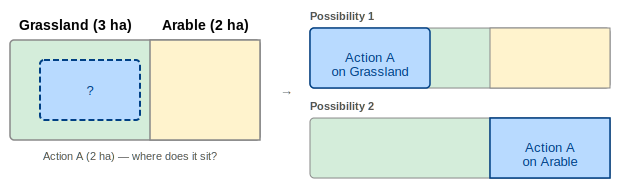
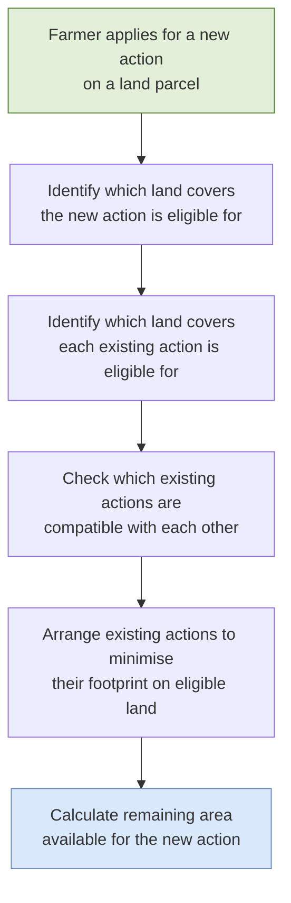
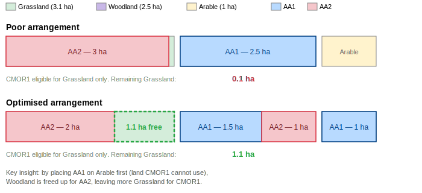
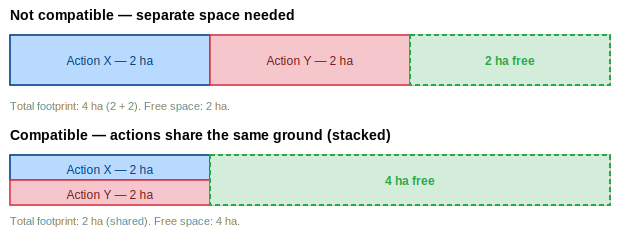
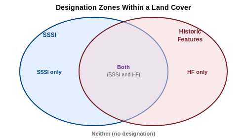
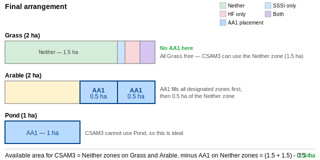

# Available Area Calculation — Explained

This document explains how the Available Area Calculation (AAC) works in plain language. It is intended for readers looking for a high-level overview.

For the full technical specification, see [available-area-calculation.md](./available-area-calculation.md).

---

## What is this about?

The Department for Environment, Food & Rural Affairs (Defra) runs schemes that pay farmers and land managers to carry out environmental activities on their land — things like managing hedgerows, reducing livestock grazing on moorland, or improving soil health. These activities are called **Actions**.

Before a farmer can sign up for a new action, the system needs to answer a simple question: **how much of their land is actually available for it?** The Available Area Calculation (AAC) works this out.

---

## Key Terms

Before diving in, here are the terms you will encounter throughout this document:

| Term                       | What it means                                                                                                                                                                                                                                |
| :------------------------- | :------------------------------------------------------------------------------------------------------------------------------------------------------------------------------------------------------------------------------------------- |
| **Land Parcel**            | A defined unit of land — typically a single field. A farm is made up of many parcels.                                                                                                                                                        |
| **Land Cover**             | What the land is physically used for. A single parcel can contain multiple land covers — for example, part of a field might be grassland and part might be arable (crop-growing) land. Each land cover has a measured area in hectares (ha). |
| **Action**                 | A specific environmental activity that a farmer can be paid to carry out — for example, "assess moorland and produce a written record" (code CMOR1) or "low livestock grazing on moorland" (code UPL2).                                      |
| **Eligibility**            | Each action can only be carried out on certain types of land cover. For example, a grassland management action can only go on grassland, not on arable land.                                                                                 |
| **Compatibility**          | Some actions can happen on the same piece of ground at the same time (they are _compatible_). Others cannot — they need their own separate space.                                                                                            |
| **SSSI**                   | A Site of Special Scientific Interest — an area of land protected for its ecological importance (rare plants, wildlife habitats, geological features). Some actions are not allowed on SSSI land.                                            |
| **Historic Features (HF)** | Areas of archaeological or historical significance (ancient earthworks, historic buildings). Some actions are not allowed on these areas either.                                                                                             |

---

## The Problem

Imagine a farmer has a 6-hectare field. They already have two environmental actions running on parts of it. Now they want to apply for a third action. How much land is available?

This sounds simple, but there is a catch: **the system knows how much area each existing action covers, but not exactly where on the field it sits.** There are no GPS boundaries for individual actions — just a total area.

This matters because of eligibility and compatibility rules. The answer depends on _where_ the existing actions are assumed to be.

Because we do not know where the existing action sits, we have to consider different arrangements — and this is exactly what the AAC does.

---

## The "Best Case" Principle

The AAC always assumes the **most favourable arrangement for the farmer**. It logically rearranges existing actions to leave the maximum possible room for the new one.

Think of it like rearranging furniture in a room: you cannot remove any existing furniture (the existing actions stay), but you can slide them around to make as much open floor space as possible for a new piece.

The key strategies are:

1. **Push existing actions onto land the new action cannot use.** If an existing action is eligible for woodland but the new action is not, place the existing action on the woodland first — it is "out of the way."

2. **Stack compatible actions together.** If two existing actions are allowed to share the same ground, overlap them to reduce their combined footprint.

---

## How the Calculation Works

Here is the high-level process the calculation follows:

Let's walk through a worked example to see this in action.

---

## Worked Example: The Rearrangement

A farmer is applying for **CMOR1** (assess moorland) on a parcel with three land covers.

**Land covers on the parcel:**

- Grassland — 3.1 ha
- Woodland — 2.5 ha
- Arable — 1 ha

**Existing actions already on this parcel:**

- **AA1** — 2.5 ha (eligible for Woodland and Arable)
- **AA2** — 3 ha (eligible for Woodland and Grassland)

**CMOR1** is eligible for Grassland only. None of the actions are compatible with each other (they all need their own space).

### Poor arrangement

If we naively place each existing action on its first eligible land cover:

- AA1 goes on Woodland (2.5 ha — fills it completely)
- AA2 can only go on Grassland now (no Woodland left) — takes up 3 ha of the 3.1 ha

That leaves just **0.1 ha** of Grassland for CMOR1.

### Optimised arrangement

The AAC rearranges to favour the farmer:

- AA1 goes on Arable first (1 ha), then the remaining 1.5 ha on Woodland
- This leaves 1 ha of Woodland free for AA2
- AA2 uses 1 ha Woodland + 2 ha Grassland

That leaves **1.1 ha** of Grassland for CMOR1 — over ten times more.

The difference is significant — over ten times more land available — simply by rearranging where the existing actions are assumed to sit.

---

## Stacking: When Actions Share Space

Some environmental actions are **compatible** — they can happen on the same piece of ground at the same time. For example, a soil assessment and a hedgerow management action might both be carried out on the same area without conflicting.

When compatible actions are "stacked" together, they occupy the same area rather than each needing their own separate space. This reduces the total footprint of existing actions and leaves more room for the new one.

By stacking compatible actions, the free space doubles from 2 ha to 4 ha. The AAC automatically identifies which actions can stack and arranges them to minimise the overall footprint.

---

## Protected Land: SSSI and Historic Features

Some land has special protections that restrict what activities can take place on it.

**Sites of Special Scientific Interest (SSSI)** are areas designated for their ecological or geological importance — they might contain rare wildlife, unusual geological formations, or important habitats. Natural England oversees these designations.

**Historic Features (HF)** are areas of archaeological or historical significance — ancient earthworks, historic farm buildings, or other features that need to be preserved.

These two types of protection are independent of each other and can overlap. This means any piece of land within a parcel falls into one of four zones:

### How designations affect the calculation

Each action has its own eligibility for SSSI and HF land. An action can only be placed on a zone if it is eligible for **every** designation in that zone:

| Action eligibility | Neither | SSSI only | HF only | Both (SSSI and HF) |
| :----------------- | :------ | :-------- | :------ | :----------------- |
| Eligible for both  | Yes     | Yes       | Yes     | Yes                |
| SSSI eligible only | Yes     | Yes       | No      | No                 |
| HF eligible only   | Yes     | No        | Yes     | No                 |
| Neither            | Yes     | No        | No      | No                 |

The AAC uses designations as another way to optimise the arrangement. If an existing action _is_ eligible for a protected zone but the new action _is not_, the calculation prefers to place the existing action on the protected zone — because that land is "out of bounds" for the new action anyway, so there is no loss.

---

## Full Worked Example with Designations

This example shows all the concepts working together.

**Applying for:** CSAM3 (a soil assessment action — **not** eligible for SSSI land, **not** eligible for HF land)

**Existing action:** AA1 — 2 ha (eligible for **both** SSSI and HF land)

AA1 and CSAM3 are **not compatible** (they cannot share the same ground).

**Land covers on the parcel:**

| Land Cover | Total area | SSSI overlap | HF overlap | Both (SSSI and HF) |
| :--------- | :--------- | :----------- | :--------- | :----------------- |
| Grass      | 2 ha       | 0.3 ha       | 0.4 ha     | 0.2 ha             |
| Arable     | 2 ha       | 0.4 ha       | 0.3 ha     | 0.2 ha             |
| Pond       | 1 ha       | 0.1 ha       | 0.1 ha     | 0 ha               |

**Eligibility:**

- CSAM3 is valid on Grass and Arable
- AA1 is valid on Arable and Pond

### Step 1 — Work out the designation zones

For Grass (2 ha total):

- SSSI only: 0.3 - 0.2 = **0.1 ha**
- HF only: 0.4 - 0.2 = **0.2 ha**
- Both: **0.2 ha**
- Neither: 2 - 0.3 - 0.4 + 0.2 = **1.5 ha**

For Arable (2 ha total):

- SSSI only: 0.4 - 0.2 = **0.2 ha**
- HF only: 0.3 - 0.2 = **0.1 ha**
- Both: **0.2 ha**
- Neither: 2 - 0.4 - 0.3 + 0.2 = **1.5 ha**

Because CSAM3 is ineligible for both SSSI and HF, it can only use the **Neither** zones: 1.5 ha (Grass) + 1.5 ha (Arable) = **3 ha maximum**.

### Step 2 — Place the existing action, starting with land CSAM3 cannot use

AA1 (2 ha) is valid for Arable and Pond. Pond is not valid for CSAM3, so place AA1 there first:

- **1 ha on Pond** (all of it — Pond is completely out of CSAM3's reach)
- **1 ha on Arable** (the remainder)

### Step 3 — Within shared land covers, prefer designated zones

AA1 still has 1 ha sitting on Arable — land that CSAM3 also needs. But AA1 is eligible for all designation zones, while CSAM3 is not. So the calculation places AA1 on the **designated portions** of Arable first:

- Arable's designated zones total 0.5 ha (0.2 SSSI-only + 0.1 HF-only + 0.2 Both)
- AA1 occupies all 0.5 ha of designated Arable, plus 0.5 ha of undesignated ("Neither") Arable

### Result

The available area for CSAM3 is **2.5 ha**.

The calculation achieved this by:

1. Placing AA1 on Pond first (1 ha) — land that CSAM3 cannot use at all
2. Placing the remaining AA1 area on the designated (SSSI/HF) portions of Arable — zones that CSAM3 cannot use due to its ineligibility for protected land
3. Only 0.5 ha of AA1 ended up on undesignated Arable — the only part that directly reduces CSAM3's available area

---

## Summary

The Available Area Calculation determines the maximum land available for a new environmental action by:

1. **Filtering** land covers to find where the new action is eligible
2. **Checking compatibility** between all actions to identify which can share space
3. **Optimally arranging** existing actions to minimise their overlap with land the new action needs — by pushing them onto ineligible land covers and protected zones first
4. **Stacking** compatible actions together to reduce their combined footprint
5. **Returning** the remaining eligible area as the available area for the new action

The calculation always assumes the best possible arrangement for the farmer, ensuring the maximum available area is reported.
