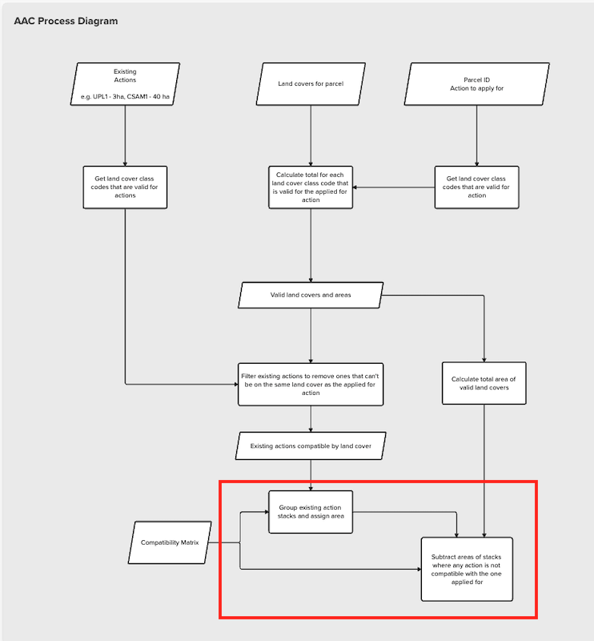

## Available Area Calculation (AAC)

- [Back home](../readme.md)

### AAC Process Diagram

The purpose of the Available Area Calculation (AAC) is to work out the number of hectares of a land parcel someone is able to apply a particular action on. Say an applicant has a 3 hectare land parcel, has already agreed to do action **A** on 1 hectare of the parcel, is applying for action **B** and **A** and **B** aren't compatible with each other, the AAC should return 2 hectares.

Some more AAC scenarios are detailed here:

