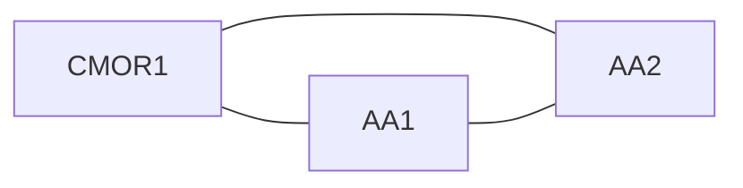

# Available Area Calculation - Linear Programming Implementation

## Why Linear Programming?

The original AAC implementation uses a greedy heuristic: it sorts existing actions by area, then stacks them one by one into compatible groups. This approach works well in most cases but is not mathematically optimal. It can produce incorrect answers when the placement of existing actions on land covers they do not share with the target action indirectly affects the space available for it (see section 5 of `available-area-calculation.md` for a full explanation).

Linear Programming (LP) solves this by formulating the problem as a mathematical optimisation. Instead of making greedy decisions one action at a time, the LP solver considers all actions, all land covers, and all compatibility relationships simultaneously to find the arrangement that provably maximises the area available for the target action.

---

## Conceptual Overview

The core question the AAC answers is:

> Given the existing actions on this parcel, what is the maximum area available for a new action?

We do not know _where_ on the parcel existing actions are physically located. We only know _how much_ area each one occupies. The LP exploits this ambiguity: it tries every possible way to arrange existing actions across the parcel's land covers, subject to compatibility and eligibility rules, and picks the arrangement that leaves the most room for the new action.

### What the LP decides

The LP's decision variables represent **how much area of each existing action to place on each land cover**. It also has a variable for each land cover representing **how much area is available there for the target action**. The solver maximises the sum of these target variables.

### What constrains the LP

Three types of constraint ensure the solution is physically valid:

1. **Demand** -- each existing action's total area must be fully allocated across the land covers it is eligible for.
2. **Eligibility** -- an action can only be placed on a land cover it is eligible for (handled implicitly by only creating variables for valid action/land-cover pairs).
3. **Capacity** -- on any single land cover, the total area used by mutually incompatible actions (including the target) cannot exceed the land cover's area. Compatible actions can share ("stack on") the same physical space, so they do not compete for capacity.

---

## Step-by-step algorithm

### Step 1: Calculate total valid land cover area

Sum the area of every parcel land cover that the target action is eligible for. This is the theoretical maximum -- the answer when there are no existing actions. If this is zero, the answer is zero immediately.

### Step 2: Build the eligibility map

For every action involved (target + all existing), determine which parcel land covers it may be placed on.

Each action has a list of `{landCoverCode, landCoverClassCode}` pairs defining which land it can occupy. These are merged into a flat set of codes using `mergeLandCoverCodes`. A parcel land cover is eligible for an action if its `landCoverClassCode` appears in that set.

This step also handles the unreliable land cover data issue: because the parcel's `landCoverClassCode` field sometimes contains a specific land cover code rather than a class code, the merged set includes both levels so either will match.

### Step 3: Build the incompatibility graph and find maximal cliques

An **incompatibility graph** is constructed where each node is an action (existing + target) and an edge connects any two actions that are **not** compatible.

We then find all **maximal cliques** in this graph using the Bron-Kerbosch algorithm. A clique is a set of actions that are all pairwise incompatible -- none of them can share the same physical space.

#### Why cliques, not just pairs?

Pairwise constraints alone are insufficient. Consider three actions A, B, C that are all mutually incompatible on a land cover of 10 sqm. Pairwise constraints would say:

- A + B <= 10
- A + C <= 10
- B + C <= 10

These constraints allow A = B = C = 5, giving a total of 15 sqm on 10 sqm of land -- physically impossible. The clique constraint `A + B + C <= 10` prevents this.

Singleton cliques (each action alone) are also added. These enforce that no single action's allocation to a land cover exceeds that land cover's area.

### Step 4: Build the LP model

The LP model is constructed in the format required by `javascript-lp-solver`:

**Variables:**

- `x_{actionCode}_{lcIndex}` for each existing action / eligible land cover pair. Represents the area of that action placed on that land cover.
- `t_{lcIndex}` for each land cover eligible for the target action. Represents the area available for the target on that land cover.

**Constraints:**

- One **demand** constraint per existing action (type: `equal`). The sum of that action's variables across all land covers must equal its area.
- One **capacity** constraint per clique per land cover (type: `max`). For each maximal clique and each land cover, the sum of allocations for clique members eligible for that land cover must not exceed the land cover's area. If the target action is a member of the clique (i.e. it is incompatible with the other members), its `t` variable is included in the sum.

**Objective:** Maximise `availableArea`, which is the sum of all `t` variables.

### Step 5: Solve and extract result

The model is passed to `solver.Solve()`. If the solution is feasible, the objective value is the maximum available area in square metres. This is converted to hectares (rounded to 4 decimal places) using `sqmToHaRounded`.

If infeasible (e.g. an existing action's area exceeds the total area of its eligible land covers, or an existing action has no eligible land covers), the result carries `feasible: false` with full context so that explanations can report why the calculation failed.

---

## Worked example

This example is from section 5 of `available-area-calculation.md`.

### Setup

**Target action:** CMOR1

**Existing actions:**

| Action | Area   |
| ------ | ------ |
| AA1    | 2.5 ha |
| AA2    | 3.0 ha |

**Compatibility:** None of the three actions (CMOR1, AA1, AA2) are compatible with each other.

**Land covers on parcel:**

| Land cover | Area   |
| ---------- | ------ |
| Grassland  | 3.1 ha |
| Woodland   | 2.5 ha |
| Arable     | 1.0 ha |

**Eligibility:**

| Action | Eligible land covers |
| ------ | -------------------- |
| CMOR1  | Grassland            |
| AA1    | Woodland, Arable     |
| AA2    | Woodland, Grassland  |

### Step 1: Total valid land cover

CMOR1 is eligible for Grassland only. Total valid = **3.1 ha**.

### Step 2: Eligibility map

| Action | Eligible indices      |
| ------ | --------------------- |
| CMOR1  | [Grassland]           |
| AA1    | [Woodland, Arable]    |
| AA2    | [Woodland, Grassland] |

### Step 3: Incompatibility graph and cliques

Since no actions are compatible, the incompatibility graph is fully connected:

Every pair is incompatible, so the single maximal clique is `{CMOR1, AA1, AA2}`. Plus three singleton cliques: `{CMOR1}`, `{AA1}`, `{AA2}`.

### Step 4: Build LP model

**Variables** (only for eligible action/land-cover pairs):

| Variable       | Meaning                               |
| -------------- | ------------------------------------- |
| `x_AA1_Wood`   | Area of AA1 on Woodland               |
| `x_AA1_Arable` | Area of AA1 on Arable                 |
| `x_AA2_Wood`   | Area of AA2 on Woodland               |
| `x_AA2_Grass`  | Area of AA2 on Grassland              |
| `t_Grass`      | Area available for CMOR1 on Grassland |

**Constraints:**

Demand:

- `x_AA1_Wood + x_AA1_Arable = 2.5` (AA1's full area must be placed)
- `x_AA2_Wood + x_AA2_Grass = 3.0` (AA2's full area must be placed)

Clique `{CMOR1, AA1, AA2}` capacity (one per land cover, only where members are eligible):

- Grassland: `x_AA2_Grass + t_Grass <= 3.1` (AA2 and CMOR1 are both eligible here; AA1 is not)
- Woodland: `x_AA1_Wood + x_AA2_Wood <= 2.5` (AA1 and AA2 are both eligible here; CMOR1 is not)
- Arable: `x_AA1_Arable <= 1.0` (only AA1 is eligible here)

Singleton capacity:

- `x_AA1_Wood <= 2.5`, `x_AA1_Arable <= 1.0`
- `x_AA2_Wood <= 2.5`, `x_AA2_Grass <= 3.1`
- `t_Grass <= 3.1`

**Objective:** Maximise `t_Grass`

### Step 5: Solve

The solver finds the optimal assignment:

| Variable       | Value   | Rationale                                    |
| -------------- | ------- | -------------------------------------------- |
| `x_AA1_Arable` | 1.0     | AA1 fills all of Arable first                |
| `x_AA1_Wood`   | 1.5     | AA1's remaining 1.5 goes to Woodland         |
| `x_AA2_Wood`   | 1.0     | Woodland has 2.5 - 1.5 = 1.0 left for AA2    |
| `x_AA2_Grass`  | 2.0     | AA2's remaining 2.0 goes to Grassland        |
| **`t_Grass`**  | **1.1** | Grassland has 3.1 - 2.0 = 1.1 left for CMOR1 |

**Available area for CMOR1 = 1.1 ha**

### Why the greedy approach can get this wrong

A greedy algorithm that doesn't consider all land covers might assign AA1 entirely to Woodland (2.5 ha, a perfect fit). That forces AA2 onto Grassland (3.0 ha out of 3.1 ha), leaving only 0.1 ha for CMOR1.

The LP avoids this by recognising that splitting AA1 across Arable and Woodland pushes less of AA2 onto Grassland, yielding a tenfold improvement: 1.1 ha instead of 0.1 ha.

---

## Key design decisions

### Using `javascript-lp-solver`

This is a pure-JavaScript LP solver already included in the project's dependencies. It handles continuous variables with linear constraints, which is exactly what this problem requires. The typical problem size (< 10 actions, < 5 land covers) is trivially fast for simplex-based solvers.

### Maximal clique enumeration

The Bron-Kerbosch algorithm with pivoting is used to find all maximal cliques. With the small number of actions in typical scenarios (1-5 existing actions + 1 target), this runs in microseconds. For the theoretical worst case, the number of maximal cliques is bounded by 3^(n/3), which for n = 10 is approximately 59.

### Designation zone splitting

SSSI and Historic Feature (HF) designations are independent layers that may overlap. When any action (target or existing) is ineligible for at least one designation, the LP runs a **designation zone splitting** pre-processing step (see section 9 of `available-area-calculation.md`).

#### Zone derivation

For each land cover the target is eligible for, the step derives up to four virtual sub-covers using inclusion-exclusion on the SSSI overlap, HF overlap, and SSSI-and-HF overlap areas:

- **Neither** — `total − SSSI − HF + both`
- **SSSI only** — `SSSI − both`
- **HF only** — `HF − both`
- **SSSI and HF** — `both`

Only zones with area > 0 are emitted. Land covers the target is not eligible for are passed through unchanged with zone `neither` (there is nothing to gain from splitting them since the target has no variable there).

#### Zone-based eligibility filtering

After splitting, each action's eligible land cover indices are filtered by its designation eligibility:

- An action **eligible for both** SSSI and HF can use all zones.
- An action **ineligible for SSSI** cannot use `sssi_only` or `sssi_and_hf` zones.
- An action **ineligible for HF** cannot use `hf_only` or `sssi_and_hf` zones.
- An action **ineligible for both** can only use `neither` zones.

This filtering applies to **all** actions — both the target and existing actions. Actions with no eligibility entry default to eligible.

The rest of the LP model operates on the expanded land cover array without modification. The solver naturally places existing eligible actions on designated zones that the target cannot use, because those zones do not compete with the target's variables and therefore leave the maximum area available for the target.

#### Worked example

**Target:** CSAM3 (ineligible for SSSI, ineligible for HF) — eligible for Arable (130) and Grass (110).

**Existing:** AA1 2 ha (eligible for SSSI, eligible for HF) — eligible for Grass (110) and Pond (240). AA1 is incompatible with CSAM3.

**Parcel composition with designation overlaps:**

| Land cover | Total | SSSI overlap | HF overlap | SSSI-and-HF overlap |
| :--------- | :---- | :----------- | :--------- | :------------------ |
| Arable     | 2 ha  | 0.5 ha       | 0.5 ha     | 0.5 ha              |
| Grass      | 2 ha  | 0.5 ha       | 0.5 ha     | 0.5 ha              |
| Pond       | 1 ha  | 0.2 ha       | 0.2 ha     | 0.2 ha              |

After splitting, the LP sees the following land cover entries (zero-area zones omitted):

| Index | Land cover         | Area   | Zone        | CSAM3 eligible? | AA1 eligible? |
| ----- | ------------------ | ------ | ----------- | --------------- | ------------- |
| 0     | Arable (neither)   | 1.5 ha | neither     | yes             | no            |
| 1     | Arable (SSSI & HF) | 0.5 ha | sssi_and_hf | no              | yes           |
| 2     | Grass (neither)    | 1.5 ha | neither     | yes             | yes           |
| 3     | Grass (SSSI & HF)  | 0.5 ha | sssi_and_hf | no              | yes           |
| 4     | Pond               | 1 ha   | neither     | no              | yes           |

(In this example SSSI and HF fully overlap, so only `neither` and `sssi_and_hf` zones appear.)

The solver places AA1 (2 ha): 1 ha on Pond (index 4), 0.5 ha on Grass SSSI & HF (index 3), 0.5 ha on Grass neither (index 2).

Available area = t₀ + t₂ = 1.5 + 1.0 = **2.5 ha**.

Without splitting, the solver would see only three land covers and would not be able to distinguish designated land from non-designated land within a single cover, producing 3.0 ha (incorrect — it ignores the designation restrictions entirely).

### Immutability of existing actions

Existing actions are passed to the LP unchanged. The AAC must not alter them (no capping, no filtering). If an existing action's area exceeds the total area of its eligible land covers, or if it has no eligible land covers at all, the LP will be infeasible. This is the correct outcome: it signals that the recorded data cannot be arranged on the parcel, and the result is returned with `feasible: false` along with full context for explanations.
