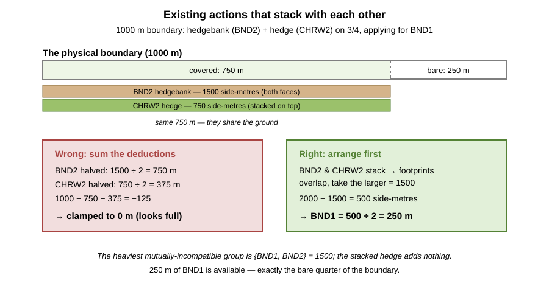
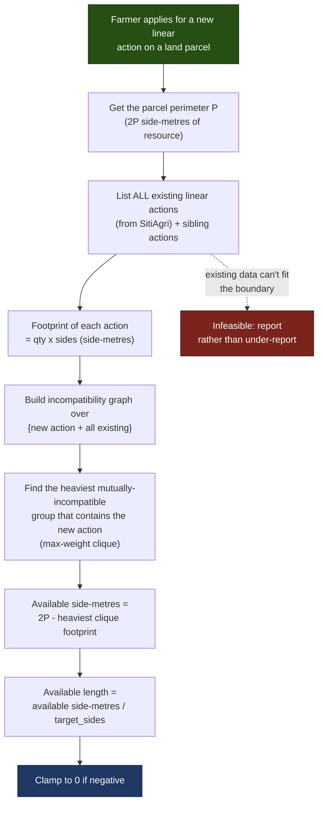

# Available Length Calculation — Explained

This document explains how the **Available Length Calculation (ALC)** works for **linear** SFI
actions, in plain language. It is intended for readers looking for a high-level overview —
caseworkers, product people, and engineers new to the area.

It is the linear-feature counterpart to the
[Available Area Calculation — Explained](../available-area-calculation/aac-explained.md), which
covers polygon (area) actions. The feature is proposed in
[LDR-005 — Linear Feature Eligibility Checking](https://github.com/DEFRA/farming-grants-docs/blob/main/docs/projects/land-grants-api/decision-records/ldr-005-linear-feature-eligibility-checking.md);
this document describes the intended calculation behind it.

---

## What is this about?

Defra runs schemes that pay farmers to look after their land. Some of those activities happen
along the **edges** of a field rather than across its surface — maintaining a dry stone wall,
looking after an earth bank, or managing a hedgerow. These are **linear actions**, and they are
measured and paid for in **metres of length** rather than hectares of area.

All linear features are assumed to run along the **outer perimeter** of the land parcel. Before a
farmer can apply for a new linear action, the system needs to answer one question: **how many
metres of that action can they still claim on this parcel?** That is the Available Length.

The answer is not simply "the perimeter", for three reasons that this document unpacks:

1. Some actions are paid for **one side** of a boundary and some for **both sides**.
2. Length already committed to **existing, incompatible** actions must be taken away — and the
   amount to take away depends on the sidedness of _both_ actions involved.
3. Existing actions that are compatible with **each other** stack onto the same boundary, so their
   footprints overlap rather than add — working out the true combined footprint is an arrangement
   problem, the same one the Available Area Calculation solves.

---

## Key Terms

| Term                         | What it means                                                                                                                                  |
| :--------------------------- | :--------------------------------------------------------------------------------------------------------------------------------------------- |
| **Land Parcel**              | A defined unit of land — typically a single field. Its boundary runs all the way round.                                                        |
| **Perimeter (P)**            | The total length of the parcel boundary, in metres. Calculated from the parcel geometry.                                                       |
| **Linear Action**            | An environmental activity applied for in metres along the boundary — e.g. maintaining a wall or managing a hedge.                              |
| **Single-side action**       | An action paid for **one face** of a boundary. The farmer can claim each side separately, so the maximum is **twice** the perimeter.           |
| **Both-sides action**        | An action paid for **both faces at once**. One claimed metre covers both sides, so the maximum is the perimeter itself.                        |
| **Side-metre**               | The unit that makes everything add up: one metre of one side of a boundary. A perimeter of `P` metres has `2P` side-metres of "resource".      |
| **Compatibility / Stacking** | Some actions can occupy the **same** stretch of boundary at the same time (they _stack_). Others cannot and each needs its own length.         |
| **Existing agreement**       | A linear action already committed on a previous agreement, retrieved from the incumbent system **SitiAgri**. Its length must be accounted for. |

---

## The three example actions

Throughout this document we use three real linear actions:

| Code      | Action                                         | Payment                    | Sidedness       |
| :-------- | :--------------------------------------------- | :------------------------- | :-------------- |
| **BND1**  | Maintain dry stone walls                       | £27 per 100 m (both sides) | **Both-sides**  |
| **BND2**  | Maintain earth banks or stone-faced hedgebanks | £11 per 100 m (one side)   | **Single-side** |
| **CHRW2** | Manage hedgerows                               | £13 per 100 m (one side)   | **Single-side** |

**Stacking rules for these actions:**

- **BND2 + CHRW2 can stack.** A stone-faced hedgebank has earth between its two faces, and a hedge
  can grow on top of that earth — so a hedgerow action can sit on the same length as the hedgebank.
- **BND1 + BND2 cannot stack.** A dry stone wall can't occupy the same ground as a stone-faced
  hedgebank — it's one or the other.
- **BND1 + CHRW2 cannot stack.** A dry stone wall has no earth for a hedge to grow in.

---

## Why sides matter — the physical picture

The single-side / both-sides distinction is not an accounting quirk; it comes straight from what
these boundaries physically are.

- A **dry stone wall (BND1)** is a **single structure**. You maintain it as one thing, and the
  payment covers **both sides** at once. One claimed metre = one metre of wall.
- A **stone-faced hedgebank (BND2)** is really **two walls with earth packed between them**. Each
  face is maintained — and paid for — **separately**. That is why it is a **single-side** action:
  to look after the whole bank along one metre of boundary, you claim **one metre for each face**,
  i.e. two metres of BND2.
- Because the bank has earth in the middle, a **hedge (CHRW2)** can grow on top — which is exactly
  why BND2 and CHRW2 are allowed to **stack** on the same length.

Hold on to the hedgebank picture: it is the reason the deduction step later is subtle.

---

## Step 1 — The base available length

Start from the perimeter and adjust for sidedness.

- For a **both-sides** action (BND1): base available length = **P**. _Do not_ double the perimeter —
  one claimed metre already covers both sides.
- For a **single-side** action (BND2, CHRW2): base available length = **2 × P**. Each of the two
  sides is a separate metre that can be claimed.

So for a 1000 m perimeter, BND1 starts at 1000 m available and BND2 starts at 2000 m available —
before any deductions.

---

## The unifying idea: side-metres

There is one mental model that makes the base **and** the deductions fall out consistently. Think
of the boundary as a stock of **side-metres**.

- A perimeter of `P` metres has two faces → **`2P` side-metres** of resource in total.
- A **both-sides** action consumes **2 side-metres** per claimed metre (it takes both faces).
- A **single-side** action consumes **1 side-metre** per claimed metre (it takes one face).

The base available length is just the whole `2P` resource expressed in the action's own units:

- both-sides: `2P ÷ 2 = P`
- single-side: `2P ÷ 1 = 2P`

Keep this in your head — it is the key to Step 2.

---

## Step 2 — Subtracting existing actions (the tricky bit)

Any linear action already on a previous agreement (from SitiAgri) has consumed part of the
boundary. We must take that away. Three subtleties:

1. **Only _incompatible_ existing actions are subtracted.** If an existing action can stack with
   the one we're applying for, it shares the length and costs nothing (see
   [Scenario C](#scenario-c--stacking-a-compatible-action-costs-nothing)).
2. **The amount to subtract for one action depends on the sidedness of _both_ actions.** An
   existing action's length is recorded in _its own_ units, but we need the deduction in the
   _target_ action's units.
3. **You cannot simply add the deductions up.** Existing actions that are compatible with **each
   other** stack onto the _same_ stretch of boundary, so their footprints overlap rather than sum.
   Working out the true combined footprint is an arrangement problem — the subject of
   [Putting the footprints together](#putting-the-footprints-together--the-best-case-arrangement)
   below, and the reason the ALC is nearly as involved as the Available Area Calculation.

We build up to the answer in two stages: first the footprint of a **single** existing action
(subtlety 2), then how to **combine** footprints correctly (subtlety 3).

### One action's footprint

Convert through side-metres. An existing action of quantity `q` consumes `q × existing_sides`
side-metres. Expressed in the target action's units, that is:

> **deduction = existing_qty × (existing_sides ÷ target_sides)**
>
> where `sides` = **2** for a both-sides action and **1** for a single-side action.

This produces four cases:

| Available Length is for →          | Existing **both-sides** action | Existing **single-side** action |
| :--------------------------------- | :----------------------------- | :------------------------------ |
| **Both-sides** target (base = P)   | subtract **as-is**             | **halve** it                    |
| **Single-side** target (base = 2P) | **double** it                  | subtract **as-is**              |

The two "same sidedness" cases are intuitive — subtract like for like. The two mixed cases are
where mistakes happen, and the next scenarios show each one.

### Putting the footprints together — the best-case arrangement

It is tempting to work out each incompatible action's footprint and add them all up. **That is
wrong**, and it is the single biggest trap in the ALC.

Existing actions that are compatible **with each other** occupy the _same_ physical boundary — they
stack. Their footprints overlap, so the combined footprint is **not** the sum. As with the
Available Area Calculation, we do not know _where_ on the boundary each existing action physically
sits, so we assume the arrangement most favourable to the applicant: existing actions are packed
together as tightly as their compatibility allows, leaving the **maximum** possible length free for
the new action.

This is exactly the AAC's "best case" / ephemeral-stacking principle, applied to one dimension:

- Two existing actions that are **compatible** with each other can be laid on the same stretch —
  the space they jointly need is the **larger** of the two, not the sum.
- Two existing actions that are **incompatible** with each other need **separate** stretches — here
  the footprints **do** add.

So the deduction is driven by the **heaviest group of existing actions that are (a) all incompatible
with the new action _and_ (b) all mutually incompatible with each other.** Such a group cannot be
stacked apart at all, so its footprints genuinely add; any other existing action either stacks with
the new action (costs nothing) or stacks onto a member of that group (adds nothing extra).

In graph terms this "heaviest mutually-incompatible group" is a **maximum-weight clique** in the
incompatibility graph — the very same construct the AAC builds (see
[aac-technical-deep-dive.md](../available-area-calculation/aac-technical-deep-dive.md), Step 3).
The ALC is essentially that calculation with a **single resource** (the boundary) and **no land
covers or designations**, which is why it reduces to one clean subtraction:

> **available side-metres = 2P − (heaviest incompatible clique's footprint)**
>
> then divide by the target's sidedness to get the available length.

[Scenario D](#scenario-d--stacking-among-existing-actions) shows why the naïve sum fails and this
arrangement is needed.

### Include every existing action — don't drop the compatible ones

An action that is compatible with the new action costs nothing against it, so it is tempting to
**discard** such actions up front. Do not. The AAC learned this the hard way: dropping
target-compatible actions produced wrong answers, because a compatible action can **displace** a
third, incompatible action onto land the new action needs.

That displacement needs two ingredients that the AAC has but the ALC does not: **multiple land
covers**, and **eligibility rules that give existing actions a _choice_ of where to sit**. A
target-compatible action can monopolise a cover the target does not use, forcing an incompatible
action off it and onto the target's cover. The ALC has a **single, uniform resource** and no
eligibility, so there is no "elsewhere" to push anything and no choice to exploit — the target's
result depends only on cliques that _contain_ the target, and a target-compatible action is by
definition never in one. Given feasible data, the answer is therefore the same whether or not those
actions are present.

So why keep them? Two reasons:

1. **Feasibility.** "Same answer" holds only while the existing agreements actually fit on the
   boundary. If SitiAgri returns more incompatible existing length than the boundary can hold, the
   honest result is "this data cannot be arranged" — the ALC's equivalent of the AAC's
   `feasible: false`. You can only detect that if you keep every action in the arrangement.
2. **Consistency.** Feeding _all_ actions into the incompatibility graph and letting the
   clique arithmetic assign compatible ones zero weight — rather than special-casing a "drop" step —
   keeps the ALC structurally identical to the AAC and removes a whole class of "when is dropping
   safe?" mistakes.

> **Assumption — one uniform boundary.** This safety rests entirely on the boundary being a single
> homogeneous resource with no eligibility. It would no longer hold if we modelled the two **faces**
> as separate resources, or modelled **boundary composition** (a wall action only where there is a
> wall, a hedgebank action only on hedgebank segments). Either turns segments into land-cover-like
> resources with a choice of placement, and the AAC's displacement problem — and the danger of
> dropping — returns in full.

---

## Scenario A — Halving: the motivating example

> A farmer applies to maintain a field with a **1000 m** perimeter. Half the boundary is a **stone
> wall**; the other half is a **stone-faced hedgebank**. They already maintain the hedgebank, and
> SitiAgri returns **1000 m** of existing BND2. What is available for **BND1** (the wall)?

- **Target:** BND1 — **both-sides** → base = P = **1000 m**.
- **Existing:** BND2 = **1000 m**. Why 1000 and not 500? The hedgebank covers 500 m of physical
  boundary, but BND2 is single-side, so maintaining **both faces** of that 500 m is claimed as
  `2 × 500 = 1000 m` of BND2.
- **Deduction:** existing is single-side, target is both-sides → **halve** it: `1000 ÷ 2 = 500 m`.
- **Available = 1000 − 500 = 500 m.** ✅

That 500 m is exactly the free stone-wall half. Note the trap: naively subtracting the raw 1000 m
would have given **0 m available**, wrongly implying there is no boundary left — even though half
the physical boundary is untouched.

**Side-metre check:** total `2P = 2000` side-metres; BND2 consumes `1000 × 1 = 1000`; remaining
`1000` side-metres ÷ 2 (both-sides target) = **500 m**. ✔

---

## Scenario B — Doubling: single-side target, both-sides existing

> A farmer applies for **CHRW2** (a hedgerow, single-side) on a parcel with an **800 m** perimeter.
> A **300 m** stretch already has a **BND1** dry stone wall from a previous agreement. BND1 and
> CHRW2 cannot stack. What is available for CHRW2?

- **Target:** CHRW2 — **single-side** → base = 2P = **1600 m**.
- **Existing:** BND1 = **300 m** (both-sides).
- **Deduction:** existing is both-sides, target is single-side → **double** it: `300 × 2 = 600 m`.
- **Available = 1600 − 600 = 1000 m.**

Why double? The 300 m of wall occupies **both faces** of 300 m of boundary. In single-side CHRW2
terms, that's `2 × 300 = 600 m` of side length removed from the 1600 m pool.

**Side-metre check:** total `2P = 1600`; BND1 consumes `300 × 2 = 600`; remaining `1000`
side-metres ÷ 1 (single-side target) = **1000 m**. ✔

---

## Scenario C — Stacking: a compatible action costs nothing

> A farmer applies for **BND2** (hedgebank, single-side) on a **600 m** perimeter parcel. A **600 m**
> **CHRW2** hedgerow already runs along the whole boundary from a previous agreement. What is
> available for BND2?

- **Target:** BND2 — **single-side** → base = 2P = **1200 m**.
- **Existing:** CHRW2 = 600 m — but **CHRW2 and BND2 stack** (hedge on hedgebank). Compatible
  actions share the length, so **nothing is deducted**.
- **Available = 1200 − 0 = 1200 m.**

The hedge and the hedgebank occupy the same ground; the hedge does not use up any of the length
that the hedgebank needs. Only **incompatible** existing actions reduce the total.

---

## Scenario D — Stacking among existing actions

> A farmer has a **stone-faced hedgebank with a hedge on top** along **three-quarters** of a
> **1000 m** perimeter — already in an agreement as BND2 **and** CHRW2. They now apply for **BND1**
> (a dry stone wall), which is incompatible with _both_ existing actions. What is available?

The 750 m of covered boundary carries two existing actions stacked together:

- **BND2** (single-side, both faces of the 750 m bank) = `2 × 750 = 1500 m` → 1500 side-metres.
- **CHRW2** (the hedge on top, single-side) = 750 m → 750 side-metres.

**Target:** BND1 — **both-sides** → base = P = **1000 m** (i.e. 2000 side-metres of resource).

**The wrong way (summing):**

- BND2 deduction (single→both, halve): `1500 ÷ 2 = 750 m`
- CHRW2 deduction (single→both, halve): `750 ÷ 2 = 375 m`
- Sum = 1125 m → `1000 − 1125 = −125` → clamped to **0 m**. ❌

That says the whole boundary is used up — but a quarter of it is plainly bare.

**The right way (arrange first).** BND2 and CHRW2 are **compatible with each other**, so they
occupy the _same_ 750 m. They cannot be in the same mutually-incompatible group, so we never add
their footprints. The groups (cliques) that include the target are:

| Group (clique) with BND1 | Footprint (side-metres) |
| :----------------------- | :---------------------- |
| {BND1, BND2}             | 1500                    |
| {BND1, CHRW2}            | 750                     |

The **heaviest** is 1500 side-metres. So:

- **Available side-metres = 2000 − 1500 = 500** → BND1 (both-sides) = `500 ÷ 2 = **250 m**.** ✅

That 250 m is exactly the free quarter of the boundary. The stacked hedge added **nothing** to the
deduction, because it was hiding inside the hedgebank's footprint all along.

---

## Scenario E — Everything at once

> A farmer applies for **BND2** (single-side) on a **1000 m** perimeter parcel. Two things already
> exist from previous agreements: a **400 m CHRW2** hedgerow (which stacks with BND2) and a
> **200 m BND1** dry stone wall (which does not).

- **Target:** BND2 — **single-side** → base = 2P = **2000 m**.
- **CHRW2 (400 m):** compatible with BND2 → not in any incompatible group → **costs nothing**.
- **BND1 (200 m):** incompatible with BND2. Heaviest incompatible group = {BND2, BND1}; BND1's
  footprint is both-sides → `200 × 2 = 400` side-metres.
- **Available = 2000 − 400 = 1600 m** (single-side target, ÷ 1).

**Side-metre check:** total `2P = 2000`; heaviest incompatible clique = {BND1} at 400; remaining
`1600` side-metres ÷ 1 = **1600 m**. ✔

> **A note on clamping:** if — even after the best-case arrangement — the heaviest incompatible
> group still exceeds the base, the available length would go negative. In that case the parcel has
> **no length available** for the new action (treated as 0), and the application fails validation.

---

## The process, end to end

---

## How the system implements this

- **Perimeter** comes from the parcel geometry via PostGIS `ST_Perimeter`, in
  `src/features/parcel/queries/getParcelBoundary.query.js`.
- **Existing agreements** are retrieved from SitiAgri through the Data Access Layer; linear
  quantities arrive as `actionMTL` (metres) and are normalised in
  `src/features/agreements/transformers/agreements.transformer.js`.
- **Compatibility / stacking** is decided by the compatibility matrix
  (`src/features/available-area/compatibilityMatrix.js`) — the same source the Available Area
  Calculation uses.
- **Arranging existing actions** should reuse the AAC's stacking machinery: the incompatibility
  graph and maximal-clique enumeration (Bron–Kerbosch) described in
  `docs/available-area-calculation/aac-technical-deep-dive.md`. Because the ALC has a single
  resource and no land covers or designations, the full LP collapses to picking the
  **heaviest incompatible clique** and subtracting its footprint — but sharing the AAC's graph and
  clique code keeps the two calculations consistent.
- **The calculation** is assembled in `src/features/available-length/availableLength.js`, and a
  rules-engine rule (`src/features/rules-engine/rules/1.0.0/minimum-length.md`) caps an
  application at the available length, failing with a clear message if more is applied for.

  > **Note — current gap:** as written today, `availableLength.js` sums the raw lengths of
  > incompatible actions. It does **not** yet apply the sidedness conversion, the base doubling,
  > or the best-case arrangement, so it will under-report available length whenever existing
  > actions stack with each other (as in Scenario D). Closing that gap is the work proposed in
  > LDR-005.

- **Sidedness is intended to be a per-action config flag** (single-side vs both-sides), per
  LDR-005 — so introducing a new linear action needs no code change, just configuration.

---

## Summary

The Available Length Calculation works out how many metres of a new linear action a parcel can
still take:

1. **Think in side-metres** — a boundary of `P` metres holds `2P` side-metres; a both-sides action
   uses 2 per metre, a single-side action uses 1.
2. **Include every existing action** (plus sibling actions) and size each one's footprint in
   side-metres (`qty × existing_sides`). Don't drop the ones compatible with the new action — the
   clique arithmetic gives them zero weight on their own, and keeping them lets you spot existing
   data that cannot fit the boundary.
3. **Arrange for the best case** — actions compatible with _each other_ share the same stretch, so
   find the **heaviest group that is mutually incompatible _and_ contains the new action** (a
   max-weight clique); only that group's footprints genuinely add up.
4. **Subtract and convert** — `available side-metres = 2P − heaviest-clique footprint`, then divide
   by the target's sidedness (giving base `P` for both-sides, `2P` for single-side). **Clamp to
   zero** if negative.

Two subtleties trip people up. First (Scenarios A–B): because a stone-faced hedgebank is effectively
two walls, a single-side action's recorded length is not directly comparable to a both-sides
action's — you must convert through sidedness. Second (Scenario D): existing actions that are
compatible with each other stack onto the same boundary, so you must **arrange before you subtract**
rather than summing deductions — otherwise you wrongly wipe out boundary that is genuinely free.
This second point is why the ALC is nearly as involved as the Available Area Calculation, and why it
reuses the same incompatibility-graph and clique machinery.
