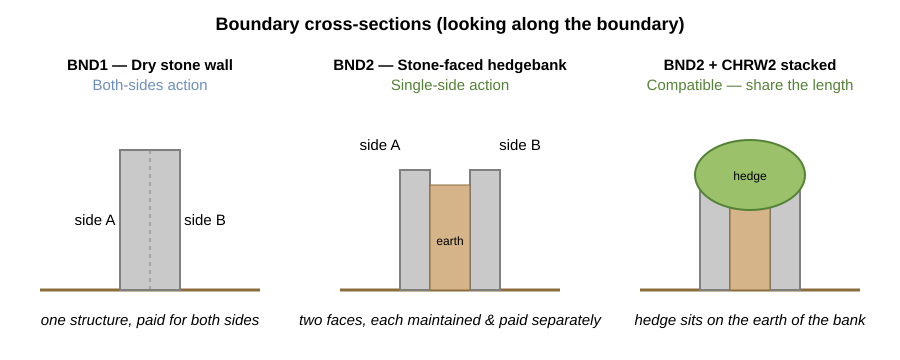
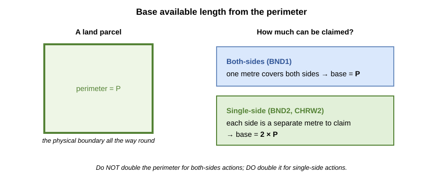
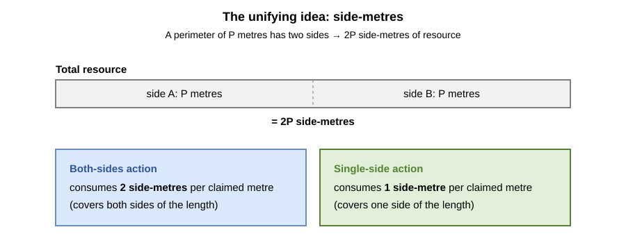
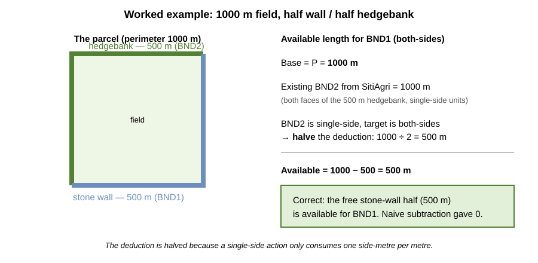
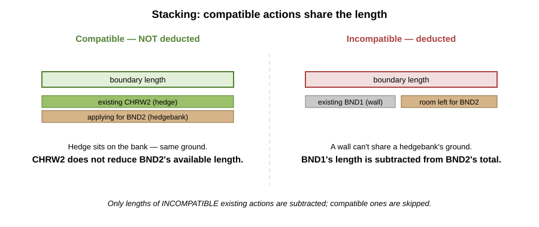
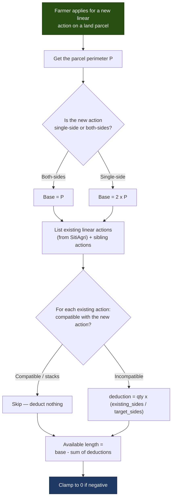

# Available Length Calculation — Explained

This document explains how the **Available Length Calculation (ALC)** works for **linear** SFI
actions, in plain language. It is intended for readers looking for a high-level overview —
caseworkers, product people, and engineers new to the area.

It is the linear-feature counterpart to the
[Available Area Calculation — Explained](../available-area-calculation/aac-explained.md), which
covers polygon (area) actions. The feature is proposed in
[LDR-005 — Linear Feature Eligibility Checking](https://github.com/DEFRA/farming-grants-docs/blob/main/docs/projects/land-grants-api/decision-records/ldr-005-linear-feature-eligibility-checking.md);
this document describes the intended calculation behind it.

---

## What is this about?

Defra runs schemes that pay farmers to look after their land. Some of those activities happen
along the **edges** of a field rather than across its surface — maintaining a dry stone wall,
looking after an earth bank, or managing a hedgerow. These are **linear actions**, and they are
measured and paid for in **metres of length** rather than hectares of area.

All linear features are assumed to run along the **outer perimeter** of the land parcel. Before a
farmer can apply for a new linear action, the system needs to answer one question: **how many
metres of that action can they still claim on this parcel?** That is the Available Length.

The answer is not simply "the perimeter", for two reasons that this document unpacks:

1. Some actions are paid for **one side** of a boundary and some for **both sides**.
2. Length already committed to **existing, incompatible** actions must be taken away — and the
   amount to take away depends on the sidedness of _both_ actions involved.

---

## Key Terms

| Term                         | What it means                                                                                                                                  |
| :--------------------------- | :--------------------------------------------------------------------------------------------------------------------------------------------- |
| **Land Parcel**              | A defined unit of land — typically a single field. Its boundary runs all the way round.                                                        |
| **Perimeter (P)**            | The total length of the parcel boundary, in metres. Calculated from the parcel geometry.                                                       |
| **Linear Action**            | An environmental activity applied for in metres along the boundary — e.g. maintaining a wall or managing a hedge.                              |
| **Single-side action**       | An action paid for **one face** of a boundary. The farmer can claim each side separately, so the maximum is **twice** the perimeter.           |
| **Both-sides action**        | An action paid for **both faces at once**. One claimed metre covers both sides, so the maximum is the perimeter itself.                        |
| **Side-metre**               | The unit that makes everything add up: one metre of one side of a boundary. A perimeter of `P` metres has `2P` side-metres of "resource".      |
| **Compatibility / Stacking** | Some actions can occupy the **same** stretch of boundary at the same time (they _stack_). Others cannot and each needs its own length.         |
| **Existing agreement**       | A linear action already committed on a previous agreement, retrieved from the incumbent system **SitiAgri**. Its length must be accounted for. |

---

## The three example actions

Throughout this document we use three real linear actions:

| Code      | Action                                         | Payment                    | Sidedness       |
| :-------- | :--------------------------------------------- | :------------------------- | :-------------- |
| **BND1**  | Maintain dry stone walls                       | £27 per 100 m (both sides) | **Both-sides**  |
| **BND2**  | Maintain earth banks or stone-faced hedgebanks | £11 per 100 m (one side)   | **Single-side** |
| **CHRW2** | Manage hedgerows                               | £13 per 100 m (one side)   | **Single-side** |

**Stacking rules for these actions:**

- **BND2 + CHRW2 can stack.** A stone-faced hedgebank has earth between its two faces, and a hedge
  can grow on top of that earth — so a hedgerow action can sit on the same length as the hedgebank.
- **BND1 + BND2 cannot stack.** A dry stone wall can't occupy the same ground as a stone-faced
  hedgebank — it's one or the other.
- **BND1 + CHRW2 cannot stack.** A dry stone wall has no earth for a hedge to grow in.

---

## Why sides matter — the physical picture

The single-side / both-sides distinction is not an accounting quirk; it comes straight from what
these boundaries physically are.

- A **dry stone wall (BND1)** is a **single structure**. You maintain it as one thing, and the
  payment covers **both sides** at once. One claimed metre = one metre of wall.
- A **stone-faced hedgebank (BND2)** is really **two walls with earth packed between them**. Each
  face is maintained — and paid for — **separately**. That is why it is a **single-side** action:
  to look after the whole bank along one metre of boundary, you claim **one metre for each face**,
  i.e. two metres of BND2.
- Because the bank has earth in the middle, a **hedge (CHRW2)** can grow on top — which is exactly
  why BND2 and CHRW2 are allowed to **stack** on the same length.

Hold on to the hedgebank picture: it is the reason the deduction step later is subtle.

---

## Step 1 — The base available length

Start from the perimeter and adjust for sidedness.

- For a **both-sides** action (BND1): base available length = **P**. _Do not_ double the perimeter —
  one claimed metre already covers both sides.
- For a **single-side** action (BND2, CHRW2): base available length = **2 × P**. Each of the two
  sides is a separate metre that can be claimed.

So for a 1000 m perimeter, BND1 starts at 1000 m available and BND2 starts at 2000 m available —
before any deductions.

---

## The unifying idea: side-metres

There is one mental model that makes the base **and** the deductions fall out consistently. Think
of the boundary as a stock of **side-metres**.

- A perimeter of `P` metres has two faces → **`2P` side-metres** of resource in total.
- A **both-sides** action consumes **2 side-metres** per claimed metre (it takes both faces).
- A **single-side** action consumes **1 side-metre** per claimed metre (it takes one face).

The base available length is just the whole `2P` resource expressed in the action's own units:

- both-sides: `2P ÷ 2 = P`
- single-side: `2P ÷ 1 = 2P`

Keep this in your head — it is the key to Step 2.

---

## Step 2 — Subtracting existing actions (the tricky bit)

Any linear action already on a previous agreement (from SitiAgri) has consumed part of the
boundary. We must take that away. Two subtleties:

1. **Only _incompatible_ existing actions are subtracted.** If an existing action can stack with
   the one we're applying for, it shares the length and costs nothing (see
   [Scenario C](#scenario-c--stacking-a-compatible-action-costs-nothing)).
2. **The amount to subtract depends on the sidedness of _both_ actions.** An existing action's
   length is recorded in _its own_ units, but we need the deduction in the _target_ action's units.

Convert through side-metres. An existing action of quantity `q` consumes `q × existing_sides`
side-metres. Expressed in the target action's units, that is:

> **deduction = existing_qty × (existing_sides ÷ target_sides)**
>
> where `sides` = **2** for a both-sides action and **1** for a single-side action.

This produces four cases:

| Available Length is for →          | Existing **both-sides** action | Existing **single-side** action |
| :--------------------------------- | :----------------------------- | :------------------------------ |
| **Both-sides** target (base = P)   | subtract **as-is**             | **halve** it                    |
| **Single-side** target (base = 2P) | **double** it                  | subtract **as-is**              |

The two "same sidedness" cases are intuitive — subtract like for like. The two mixed cases are
where mistakes happen, and the next scenarios show each one.

---

## Scenario A — Halving: the motivating example

> A farmer applies to maintain a field with a **1000 m** perimeter. Half the boundary is a **stone
> wall**; the other half is a **stone-faced hedgebank**. They already maintain the hedgebank, and
> SitiAgri returns **1000 m** of existing BND2. What is available for **BND1** (the wall)?

- **Target:** BND1 — **both-sides** → base = P = **1000 m**.
- **Existing:** BND2 = **1000 m**. Why 1000 and not 500? The hedgebank covers 500 m of physical
  boundary, but BND2 is single-side, so maintaining **both faces** of that 500 m is claimed as
  `2 × 500 = 1000 m` of BND2.
- **Deduction:** existing is single-side, target is both-sides → **halve** it: `1000 ÷ 2 = 500 m`.
- **Available = 1000 − 500 = 500 m.** ✅

That 500 m is exactly the free stone-wall half. Note the trap: naively subtracting the raw 1000 m
would have given **0 m available**, wrongly implying there is no boundary left — even though half
the physical boundary is untouched.

**Side-metre check:** total `2P = 2000` side-metres; BND2 consumes `1000 × 1 = 1000`; remaining
`1000` side-metres ÷ 2 (both-sides target) = **500 m**. ✔

---

## Scenario B — Doubling: single-side target, both-sides existing

> A farmer applies for **CHRW2** (a hedgerow, single-side) on a parcel with an **800 m** perimeter.
> A **300 m** stretch already has a **BND1** dry stone wall from a previous agreement. BND1 and
> CHRW2 cannot stack. What is available for CHRW2?

- **Target:** CHRW2 — **single-side** → base = 2P = **1600 m**.
- **Existing:** BND1 = **300 m** (both-sides).
- **Deduction:** existing is both-sides, target is single-side → **double** it: `300 × 2 = 600 m`.
- **Available = 1600 − 600 = 1000 m.**

Why double? The 300 m of wall occupies **both faces** of 300 m of boundary. In single-side CHRW2
terms, that's `2 × 300 = 600 m` of side length removed from the 1600 m pool.

**Side-metre check:** total `2P = 1600`; BND1 consumes `300 × 2 = 600`; remaining `1000`
side-metres ÷ 1 (single-side target) = **1000 m**. ✔

---

## Scenario C — Stacking: a compatible action costs nothing

> A farmer applies for **BND2** (hedgebank, single-side) on a **600 m** perimeter parcel. A **600 m**
> **CHRW2** hedgerow already runs along the whole boundary from a previous agreement. What is
> available for BND2?

- **Target:** BND2 — **single-side** → base = 2P = **1200 m**.
- **Existing:** CHRW2 = 600 m — but **CHRW2 and BND2 stack** (hedge on hedgebank). Compatible
  actions share the length, so **nothing is deducted**.
- **Available = 1200 − 0 = 1200 m.**

The hedge and the hedgebank occupy the same ground; the hedge does not use up any of the length
that the hedgebank needs. Only **incompatible** existing actions reduce the total.

---

## Scenario D — Everything at once

> A farmer applies for **BND2** (single-side) on a **1000 m** perimeter parcel. Two things already
> exist from previous agreements: a **400 m CHRW2** hedgerow (which stacks with BND2) and a
> **200 m BND1** dry stone wall (which does not).

- **Target:** BND2 — **single-side** → base = 2P = **2000 m**.
- **CHRW2 (400 m):** compatible with BND2 → **skipped** (0 m deducted).
- **BND1 (200 m):** incompatible, both-sides existing vs single-side target → **double**:
  `200 × 2 = 400 m`.
- **Available = 2000 − 0 − 400 = 1600 m.**

**Side-metre check:** total `2P = 2000`; CHRW2 skipped; BND1 consumes `200 × 2 = 400`; remaining
`1600` side-metres ÷ 1 = **1600 m**. ✔

> **A note on clamping:** if existing incompatible actions add up to more than the base, the
> available length would go negative. In that case the parcel simply has **no length available**
> for the new action (treated as 0), and the application would fail validation.

---

## The process, end to end

---

## How the system implements this

- **Perimeter** comes from the parcel geometry via PostGIS `ST_Perimeter`, in
  `src/features/parcel/queries/getParcelBoundary.query.js`.
- **Existing agreements** are retrieved from SitiAgri through the Data Access Layer; linear
  quantities arrive as `actionMTL` (metres) and are normalised in
  `src/features/agreements/transformers/agreements.transformer.js`.
- **Compatibility / stacking** is decided by the compatibility matrix
  (`src/features/available-area/compatibilityMatrix.js`) — the same source the Available Area
  Calculation uses. Compatible existing actions are not subtracted.
- **The calculation** is assembled in `src/features/available-length/availableLength.js`, and a
  rules-engine rule (`src/features/rules-engine/rules/1.0.0/minimum-length.md`) caps an
  application at the available length, failing with a clear message if more is applied for.
- **Sidedness is intended to be a per-action config flag** (single-side vs both-sides), per
  LDR-005 — so introducing a new linear action needs no code change, just configuration.

---

## Summary

The Available Length Calculation works out how many metres of a new linear action a parcel can
still take:

1. **Start from the perimeter** — `P` for a both-sides action, `2 × P` for a single-side action.
2. **Think in side-metres** — a boundary of `P` metres holds `2P` side-metres; a both-sides action
   uses 2 per metre, a single-side action uses 1.
3. **Subtract only incompatible existing actions**, converting each with
   `deduction = existing_qty × (existing_sides ÷ target_sides)` — i.e. **halve** a single-side
   existing action against a both-sides target, and **double** a both-sides existing action against
   a single-side target.
4. **Let compatible actions stack** — they share the length and cost nothing.
5. **Clamp to zero** if deductions exceed the base.

The subtlety that trips people up is Step 3: because a stone-faced hedgebank is effectively two
walls, a single-side action's recorded length is not directly comparable to a both-sides action's —
you must convert through sidedness, or you will double-count (or, as in Scenario A, wrongly wipe out
half a boundary that is genuinely free).
