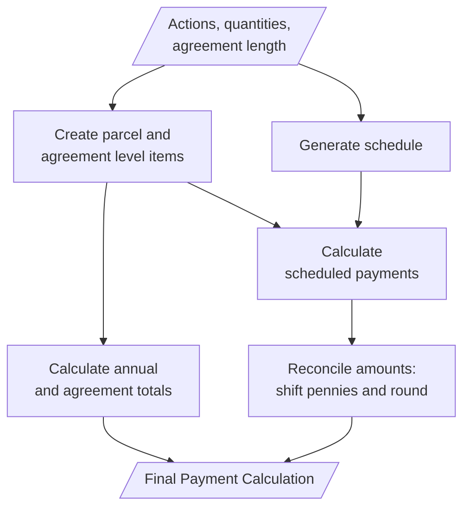

## Payment calculations

- [Back home](../README.md)

Each action has a different way of calculating the total owed annually if the application gets approved and accepted. Most are a simple multiplication of the quantity of measurement applied for by the value. For example, for **SCR1**, the calculation is `£588 per hectare (ha) per year`.

### Payment Calculation Diagram

