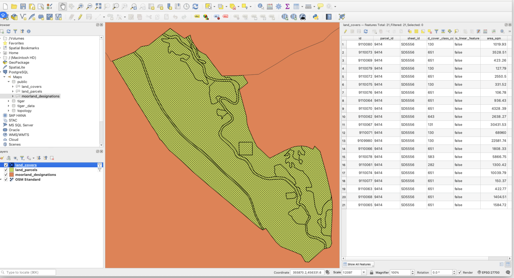

## Mapping with QGIS

- [Back home](../README.md)

### Installation

Visit https://qgis.org/download/ and download the QGIS installer

### Download project

We have a working `qgis` project available here: [qgis project](qgis.qgz)

We have the following land data available:

- `land_covers`
- `land_parcels`
- `moorland_designations`

This data is laid on top of an `Open Street Map` layer

Each `parcel` and `cover` is labelled with the `parcelId`, which is a combination of `sheetId-parcelId`

### Filtering parcels

To find a specific parcel, you can add filters, right click on the layer and click on `Filter` where you can add filters to view required land parcel data.

To view attributes, right click on the layer and click on `Open Attribute Table` where you can view attributes of the land parcel data.

Example:

